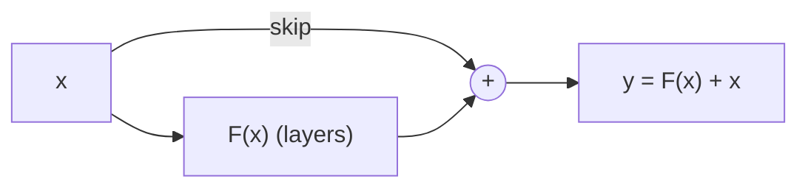

# 📚 Obsidian Study Guide Builder

> A [Claude Code](https://claude.com/claude-code) skill that turns raw course
> material into a polished, deeply interlinked [Obsidian](https://obsidian.md)
> vault you can actually study from.

Point it at your lecture slides (PDF/PPTX), a study guide (HTML/MD), or Jupyter
notebooks and it builds a complete second brain for the course — atomic notes,
teaching walkthroughs, visuals, animations, and exam-ready flashcards — all
cross-linked and verified.

---

## ✨ Install (one line)

The skill ships as a Claude Code **plugin**, so you don't clone or copy anything.
In Claude Code:

```text
/plugin marketplace add YuvGev00/obsidian-study-guide
/plugin install obsidian-study-guide@obsidian-study-guide
```

That's it. Now just ask:

> *"Turn the lecture PDFs in ~/Desktop/CS/ml/lectures into an Obsidian vault"*

The skill triggers automatically, enters **plan mode**, asks you a few scoping
questions (coverage, animation level, flashcards, build cadence…), shows you one
sample lecture to approve the style, then builds the rest.

<details>
<summary>Manual install (without the plugin system)</summary>

Clone and copy the skill folder into your skills directory:

```sh
git clone https://github.com/YuvGev00/obsidian-study-guide
cp -r obsidian-study-guide/skills/obsidian-study-guide ~/.claude/skills/
```
</details>

**Requirements:** Python with `matplotlib` + `numpy` (only for the animation
generators). The core vault is plain Markdown — Mermaid and MathJax are built into
Obsidian, no plugins required. Optional Obsidian plugins
([Spaced Repetition](https://github.com/st3v3nmw/obsidian-spaced-repetition),
[Dataview](https://github.com/blacksmithgu/obsidian-dataview)) light up flashcards
and live dashboards; the vault works without them.

---

## 🎯 What it produces

| | |
|---|---|
| **Term notes** | One per concept — formal definition, plain-words explanation with an analogy, *why it matters*, and links to everything related. |
| **Formula notes** | One per formula — a symbol-by-symbol table (every letter, sub/superscript, sum, operator), what it computes, and a worked numeric example. |
| **Lecture notes** | Full teaching walkthroughs — learn the whole lecture from the note alone, with the slides' real numbers, a problem→solution arc, and each lecture chained to the next. |
| **Navigation** | A Home map-of-content, per-kind indexes, and optional live Dataview dashboards. |
| **Visuals** | Mermaid diagrams, plotted curves, ASCII grids, GFM tables — the best type picked per concept. |
| **Animations** | Three tiers: fast template GIFs, **genuinely per-concept LLM-authored** animations, or hand-authored. Sandbox-safe. |
| **Flashcards** | `Q::A` + cloze cards per note, deck-tagged by lecture — exam-ready, Anki-exportable. |

It's **subject-agnostic** — built and verified on deep learning, plus tested
across psychology, economics, sports, medicine, and law.

---

## 👀 Sample output

A real term note the skill generated (from a deep-learning course). Every term
note follows this shape: definition → plain-words callout with an analogy → why
it matters → transcluded formulas → a visual (animation + diagram) → links → source.

````markdown
---
type: term
lecture: [L4, L7]
tags: [term, mlp]
aliases: [Residual Connection]
---
# Skip Connection

## Formal definition
A connection where an earlier value is added directly to a later one, e.g.
$\mathbf{y}=W_2\mathbf{h}+\mathbf{b}_2+\mathbf{z}$.

## In simple words
> [!tip] In simple words
> A shortcut that lets a value bypass some layers and rejoin later. Because the
> value now has two routes to the loss, its gradient is the sum of both.
>
> **Analogy:** a bypass road plus the main road both reaching the same town —
> total traffic effect is the sum of both routes.

## Why we need it
It gives gradients a short "bypass path" that mitigates vanishing gradients in
deep networks.

## Formulas
![[f- Multivariate Chain Rule]]

## Visual
**Animated:** the gradient also flows the short way back via the skip path.

![[anim_skip_connection.gif]]



## Review
<!-- #flashcards/deep-learning/L4 -->
What is a **skip connection**?::An additive shortcut so a value reaches a later
layer directly, giving gradients a bypass path.

## Related
[[Residual]] · [[Vanishing Gradients]] · [[ResNet]] · [[Multivariate Chain Rule]]

## Source
L4 (MLP & Backpropagation) — "Skip connections"
````

The `[[double-bracket links]]` connect it to every related term; hover any link
for a preview; the `## Review` card drops straight into spaced-repetition.

---

## 🛠️ What the build looks like

1. You point the skill at a folder of lecture material.
2. It enters **plan mode** and asks ~4–8 quick questions, each with a recommended
   one-click default:
   - *Coverage* — full course / match a study guide / guide + key foundations
   - *Animations* — full / selective / none / do it after the vault is built
   - *Flashcards* — on (exam-ready) / off (reading-only)
   - *Build cadence* — all at once / in batches / one lecture at a time
   - *Audience* — exam-prep / long-term reference / teaching
   - *Vault name* — confirms a name derived from your folder
3. It builds **one sample lecture** and shows it to you for sign-off.
4. After approval, it produces the rest at your chosen cadence, runs `verify.py`,
   and reports a clean vault (0 broken links).

You stay in control the whole way — nothing big happens without your go-ahead.

---

## 🧠 How it's built to be good (and cheap)

- **Asks before it builds.** A fresh build runs in plan mode and puts the real
  choices to you up front — no guessing, no runaway 600-note job you didn't want.
- **Sample-first.** On big courses it builds one lecture, shows you, and waits for
  sign-off before mass-producing — so a wrong style is caught at note 15, not 600.
- **Token-economical.** The orchestrator never bulk-reads slide images into its
  own context; reading happens in disposable sub-agents, and work is matched to
  the cheapest capable model tier.
- **Verified.** A bundled `verify.py` gate enforces zero broken links, balanced
  fences, no rendering traps — run after every pass.
- **Honest.** The docs are upfront about what each animation tier can and can't do.

---

## 📦 Repository layout

```
obsidian-study-guide/
├── README.md · LICENSE · CHANGELOG.md
├── .claude-plugin/
│   ├── plugin.json          # plugin manifest
│   └── marketplace.json     # makes this repo its own marketplace
└── skills/obsidian-study-guide/
    ├── SKILL.md             # the skill — the full playbook Claude follows
    └── assets/
        ├── templates.md                  # note templates (term/formula/lecture/index)
        ├── verify.py                     # vault verification gate
        ├── scripts.md                    # index build, GIF embed, collision fix, linking
        ├── per_term_generator.py         # template GIF generator (subject-agnostic)
        ├── llm_gif_pipeline.py           # sandboxed per-concept LLM-authored GIFs
        ├── example_subject_generator.py  # worked hand-authored generator (CNNs)
        ├── animation_generator.py        # hand-authored GIF generator + style harness
        ├── obsidian-*.json               # .obsidian config (graph colors, hover previews)
        └── README-template.md            # README dropped into a *generated* vault
```

---

## 📝 A note on generated content

The notes this skill produces are **derived from your own source material**. That
content belongs to its original author (your instructor / institution) and may
carry its own license or attribution terms — check before sharing a generated
vault publicly.

## ⚖️ License

[MIT](LICENSE) — covers the skill/tool itself, not any vault content you generate
from your own sources.
