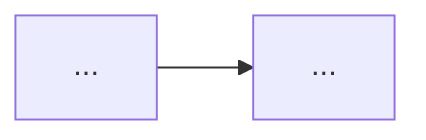
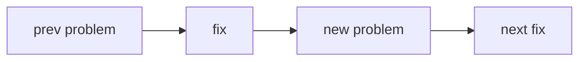

# Note templates (copy exactly; keep section order)

## Term note → `Terms/<Term Name>.md`

```
---
type: term
lecture: [L3]            # which lectures/recitations it appears in
tags: [term, <topic>]
aliases: [<synonyms or empty>]
---
# <Term Name>

## Formal definition

<precise mathematical/technical statement; split >2-sentence paras with blank lines>

## In simple words

> [!tip] In simple words
> Plain-language explanation, one idea per line.
>
> **Analogy:** an everyday analogy.

## Why we need it

<the motivation / what problem it solves; one strong "critical" line may be a `> [!important]`>

## Formulas

![[f- <Formula Name>]]
![[f- <Another Formula>]]
(omit this whole section if no formula applies)

## Visual

<one-sentence caption>



(or a ```text ASCII grid, or ```mermaid xychart-beta — pick the best per concept)
<optional one-line "Reading:" note>

## Related

[[<other term>]] · [[<other term>]] · [[f- <related formula>]]

## Source

L<n> / R<n> (slide topic)
```

If animations are enabled, the `## Visual` section starts with:
```
**Animated:** <one-line caption>

![[anim_<name>.gif]]

<then the static caption + diagram as above>
```

## Formula note → `Formulas/f- <Formula Name>.md`

```
---
type: formula
lecture: [L3]
tags: [formula]
belongs-to: ["[[<Term A>]]", "[[<Term B>]]"]
---
# <Formula Name>

$$ <LaTeX> $$

<optional one-line compact/alternate form>

## Symbol-by-symbol

| symbol | meaning | role |
|--------|---------|------|
| $w$ | weight vector | learned parameter |
| $\sum_k$ | sum over classes k | normaliser |
| ... | ... | ... |

(EVERY symbol: letters, sub/superscripts like $[l]$, operators $\sum \nabla \partial \odot$,
the $\tfrac12$, $\eta$, $\in$, sum bounds, the sign/threshold — leave nothing unexplained.)

## What it computes

<one short paragraph, plain explanation>

## Why this form

> [!tip]
> Intuition for why it is written this way (e.g. ½ for a clean derivative,
> log turns a product into a sum / is the NLL, softmax normalises).

> [!example]
> Worked numeric example with real numbers, one step per line. Verify the math.

## Used by

[[<Term A>]] · [[<Term B>]]

## Source

L<n> / R<n>
```

## Lecture/recitation note → `Lectures/L<n> - <Title>.md`

```
---
type: lecture            # or: recitation
lecture: L3
tags: [lecture]
---
# L3 — <Title>

> One-paragraph overview of this lecture's purpose.

> [!abstract] The arc of this lecture
> **Where we left off:** <link prev lecture's ending problem>.
>
> <through-line: section = problem → fix → next problem, in prose>



The problem→fix→new-problem chain this lecture follows.

## <Subtopic>

<brief formal line>. <plain-words>. <why it matters>.

![[f- <Formula>]]            <!-- transclude key results, on their own line -->

**Related:** [[Term]] · [[Term]] · [[f- Formula]]

> *We just did X; but problem Y → so next, Z.*   <!-- bridge to next section -->

## <Next Subtopic>
...

## Concepts in this lecture
[[Term]] · [[Term]] · ...    <!-- every term touched -->

## Navigation
Prev: [[L2 - ...]] · Next: [[L4 - ...]]
```

## Index notes (generate by SCRIPT from real files, not by hand)

- `Indexes/All Terms.md` — every `[[term]]` grouped under its lecture heading.
- `Indexes/All Formulas.md` — THE big formula note: per lecture, each formula's
  `### [[f- X]]` then `![[f- X]]` (so the full symbol table renders inline).
- `Indexes/All Lectures.md` — ordered list of every lecture/recitation note.
- `Home.md` — top MOC: links to the 3 indexes + every lecture + a "how to use".
